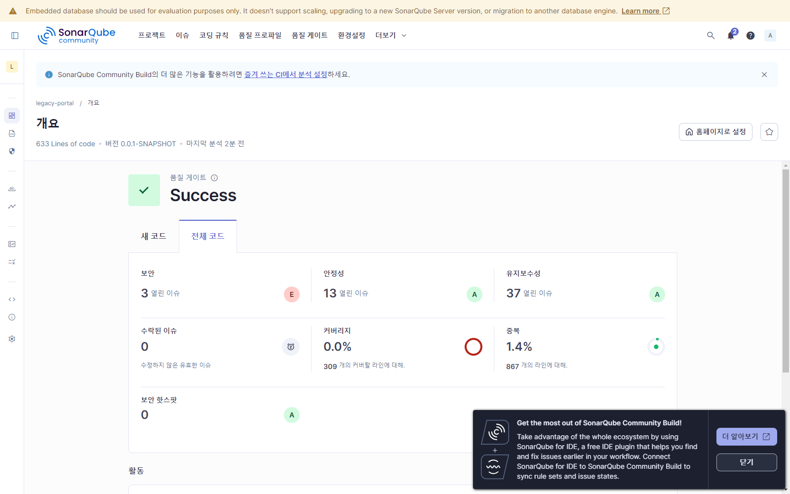
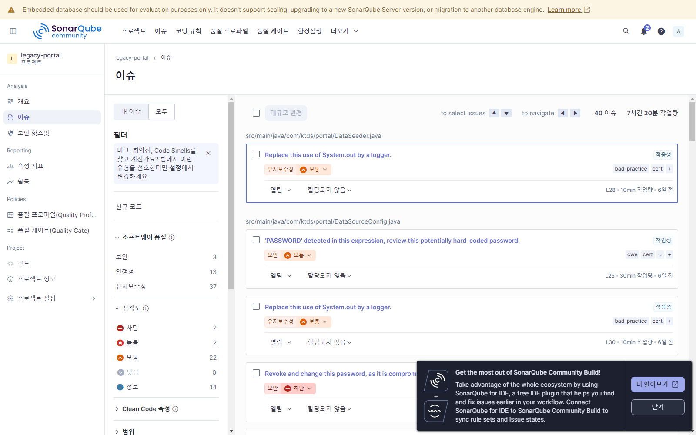
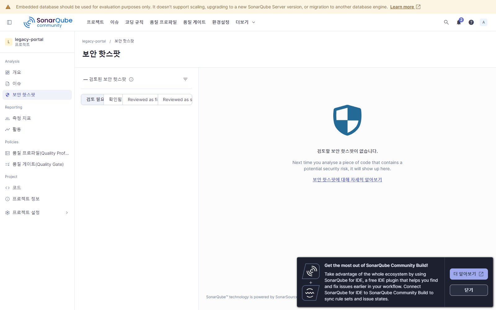
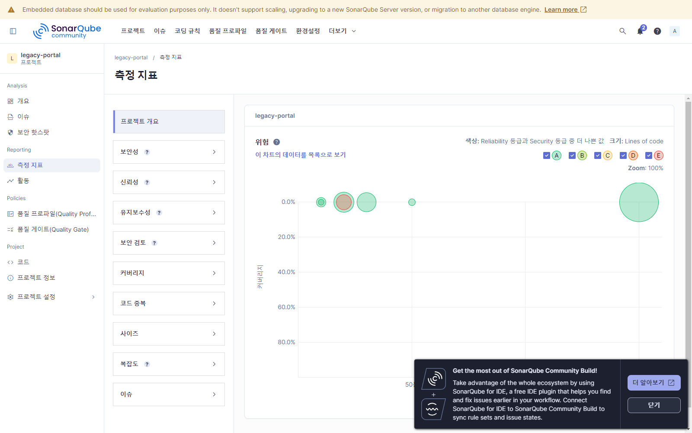

# SonarQube 정적분석 보고서 (legacy-portal)

> 이 문서는 사람이 수동으로 진단한 `docs/4-4 ~ 4-13` 시리즈(스멜 도출·심각도·우선순위)와는 별개로,
> **SonarQube Community Build 26.6.0.123539** (로컬, `D:\ktds\sonarqube`, Java 21 런타임)로
> `legacy-portal` 프로젝트를 자동 정적분석한 결과를 정리한 것이다.
> 목적은 수동 진단 결과를 **자동화 도구로 교차 검증**하는 것이며, 여기서 나온 결함도
> CLAUDE.md 원칙에 따라 **리팩토링 단계에서는 보존하고, 재설계 단계에서 다룬다.**

- 분석 일시: 2026-07-08 14:57
- 분석 방식: `mvnw.cmd org.sonarsource.scanner.maven:sonar-maven-plugin:sonar` (sonar-scanner CLI/Docker 미사용)
- 프로젝트: `legacy-portal` (0.0.1-SNAPSHOT)
- 스크린샷: `docs/sonarqube-report/`

## 1. 개요 (Overview)

| 항목 | 값 |
|---|---|
| 품질 게이트 | **Success** (`alert_status=OK`) |
| Lines of Code | 633 (전체 867 라인, 파일 19개) |
| 보안(Security) 등급 | **E** — 열린 이슈 3건 |
| 안정성(Reliability) 등급 | A — 열린 이슈 13건 (전부 INFO) |
| 유지보수성(Maintainability) 등급 | A — 열린 이슈 37건 |
| 커버리지 | 0.0% (커버할 309라인 중 0라인) — 테스트에 대한 커버리지 리포트 미연동 |
| 중복도 | 1.4% (867라인 중 중복 블록 2개) |
| 보안 핫스팟 | 0건, 등급 A |
| Cyclomatic / Cognitive Complexity | 153 / 100 |
| 기술 부채(SQALE Index) | 290분, 부채 비율 1.5% (등급 A) |

품질 게이트는 Success지만, **보안 등급만 E**로 크게 낮다 — 이는 등급 산정 방식상 보안 이슈는 단 1건만 있어도 최고 심각도 기준으로 등급이 즉시 떨어지기 때문이다 (아래 3절 BLOCKER 2건 참조).

## 2. 이슈 (Issues) — 40건 (OPEN/CONFIRMED)

### 2-1. 소프트웨어 품질(Impact)별 분포

| 품질 영역 | 이슈 수 |
|---|---|
| Maintainability (유지보수성) | 37 |
| Reliability (안정성) | 13 |
| Security (보안) | 3 |

(하나의 이슈가 여러 품질 영역에 동시에 영향을 줄 수 있어 합계는 40을 초과함 — 예: `S8688`은 Maintainability·Reliability 동시 영향)

### 2-2. 심각도(Impact Severity)별 분포

| 심각도 | 건수 |
|---|---|
| BLOCKER | 2 |
| HIGH | 2 |
| MEDIUM | 22 |
| LOW | 0 |
| INFO | 14 |

### 2-3. 규칙(Rule)별 상세

| 규칙 | 건수 | 심각도 | 내용 | 주요 위치 |
|---|---|---|---|---|
| `java:S6437` Credentials should not be hard-coded | 2 | **BLOCKER** (SECURITY) | 하드코딩된 비밀번호가 공개적으로 노출된 값과 일치("compromised") | `DataSourceConfig.java:35, 53` |
| `java:S2068` Credentials should not be hard-coded | 1 | MAJOR (SECURITY) | `PASSWORD` 필드명 자체를 하드코딩 위험으로 탐지 | `DataSourceConfig.java:25` |
| `java:S3776` Cognitive Complexity 과다 | 1 | CRITICAL (MAINTAINABILITY:HIGH) | 인지 복잡도 52 (허용 15) | `ApprovalService.java:75` |
| `java:S1192` 문자열 리터럴 중복 | 1 | CRITICAL (MAINTAINABILITY:HIGH) | `"안녕하세요 "` 3회 중복 | `ApprovalService.java:103` |
| `java:S107` 파라미터 과다 | 1 | MAJOR (MAINTAINABILITY:MEDIUM) | 파라미터 8개 (허용 7개) | `ApprovalService.java:46` |
| `java:S1066` if문 병합 가능 | 9 | MAJOR (MAINTAINABILITY:MEDIUM) | 중첩 if를 하나로 합칠 수 있음 | `ApprovalService`, `NoticeService`, `ScheduleService` |
| `java:S106` System.out 직접 사용 | 9 | MAJOR (MAINTAINABILITY:MEDIUM) | logger 대신 `System.out` 사용 | `DataSeeder`, `DataSourceConfig`, `FileAuditLogger`, `SmtpMailSender` |
| `java:S6880` if-else 체인 → switch | 2 | MAJOR (MAINTAINABILITY:MEDIUM) | 다중 분기를 switch 표현식으로 | `ApprovalService.java:172`, `NoticeService.java:78` |
| `java:S6541` Brain Method | 1 | INFO (MAINTAINABILITY) | LOC 75/복잡도 25/중첩 5/변수 14 — 모두 임계 초과 | `ApprovalService.java:75` |
| `java:S8688` `.now()`에 ZoneId/Clock 미지정 | 13 | INFO (MAINTAINABILITY·RELIABILITY) | 시간대 미고정 → 테스트·환경 이식성 저하 | `ApprovalService`, `NoticeService`, `ScheduleService` 각지 |

**교차 검증 포인트:** `ApprovalService.java:75`의 `S3776`(인지복잡도 52)·`S6541`(Brain Method)은 기존 수동 진단 문서(`4-7. 긴 메서드 탐지.md`)에서 지목한 **긴 메서드/복잡한 승인 처리 로직**과 정확히 일치하는 지점이다. `S1192`(문자열 중복)와 `S6880`(if-else 체인)도 `4-8`, `4-9` 문서의 매직넘버·강결합 진단과 같은 파일(`ApprovalService.java`)에 집중돼 있어, 사람이 짚은 "가장 문제 많은 클래스"가 도구 분석에서도 동일하게 최다 이슈 클래스로 나온다.

**수동 진단에 없던 새 발견:** `DataSourceConfig.java`의 하드코딩된 MariaDB 비밀번호(`S6437`/`S2068`)는 기존 스멜 문서들(중복·긴 메서드·매직넘버·강결합)이 다루지 않은 **보안 카테고리**이며, 보안 등급을 E로 끌어내리는 원인이다. 다만 이 값은 로컬 개발용 MariaDB(`localhost:3306/portal`) 접속 정보로, 수강생이 Docker/WSL 없이 실습하도록 만든 의도된 편의 코드(파일 상단 주석 참조)다 — 운영 자격증명이 아니지만, "하드코딩된 자격증명" 자체가 안티패턴이라는 점은 재설계 단계에서 다룰 후보로 남긴다.

## 3. 보안 핫스팟 (Security Hotspots)

0건 — 리뷰가 필요한 핫스팟 없음, 등급 A. (위 2-3의 하드코딩 자격증명은 핫스팟이 아니라 확정 이슈(Issue)로 분류됨)

## 4. 측정 지표 (Measures)

| 지표 | 값 |
|---|---|
| Lines of Code (ncloc) | 633 |
| 파일 수 | 19 |
| 클래스 수 | 18 |
| 함수 수 | 98 |
| Cyclomatic Complexity | 153 |
| Cognitive Complexity | 100 |
| 주석 비율 | 19.2% |
| 중복 라인 비율 | 1.4% (중복 블록 2개) |
| 커버리지 | 0.0% |
| 기술 부채 | 290분 (부채 비율 1.5%, 등급 A) |

**커버리지 0%인 이유:** 이번 분석은 `mvn ... sonar:sonar` 실행 시 JaCoCo 등 커버리지 리포트를 별도로 생성·연동하지 않았기 때문이며, 실제 테스트가 없다는 의미는 아니다. 커버리지를 반영하려면 `jacoco-maven-plugin`으로 리포트를 생성한 뒤 `-Dsonar.coverage.jacoco.xmlReportPaths`로 연결해야 한다.

## 5. 종합 결론

1. **품질 게이트는 통과**하지만 **보안 등급 E**가 유일한 적신호 — `DataSourceConfig.java`의 하드코딩된 DB 비밀번호 때문. 실습 편의를 위한 의도된 코드이므로 리팩토링 단계에서 동작은 보존하되, 재설계 단계에서 외부 설정(`application.yml`/환경변수)으로 옮기는 것을 검토 대상으로 기록.
2. **`ApprovalService.java`가 가장 문제가 집중된 파일** — 긴 메서드(Cognitive Complexity 52), 문자열 중복, if-else 체인, 파라미터 과다가 한 곳에 몰려 있어 기존 수동 진단(4-7~4-9)과 SonarQube 자동 분석이 서로를 뒷받침한다.
3. **`System.out` 직접 로깅(9건)**과 **병합 가능한 if문(9건)**이 가장 빈번한 반복 패턴 — 파일 전반에 걸친 공통 스멜로, 규칙 기반 일괄 리팩토링(logger 도입, 조건문 병합) 후보.
4. `.now()` 시간대 미지정(13건)은 심각도는 낮지만 건수가 가장 많은 항목 — 테스트 결정성·타임존 이식성 관점에서 재설계 백로그에 낮은 우선순위로 등재할 만하다.

## 참고

- 관리자 콘솔: http://localhost:9000/dashboard?id=legacy-portal
- 한국어 언어팩 `sonar-l10n-ko-plugin-25.8`이 적용된 화면 기준 캡처 (버전 25.8용 팩을 26.6에 설치 — UI 텍스트 대부분 정상 번역되나 일부 신규 문자열은 영어로 표시될 수 있음)
